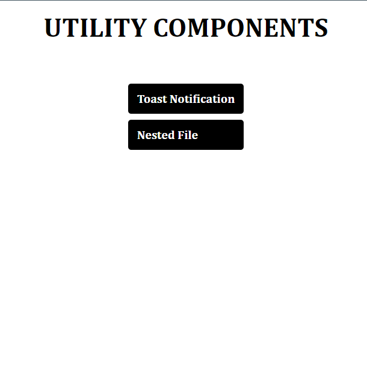
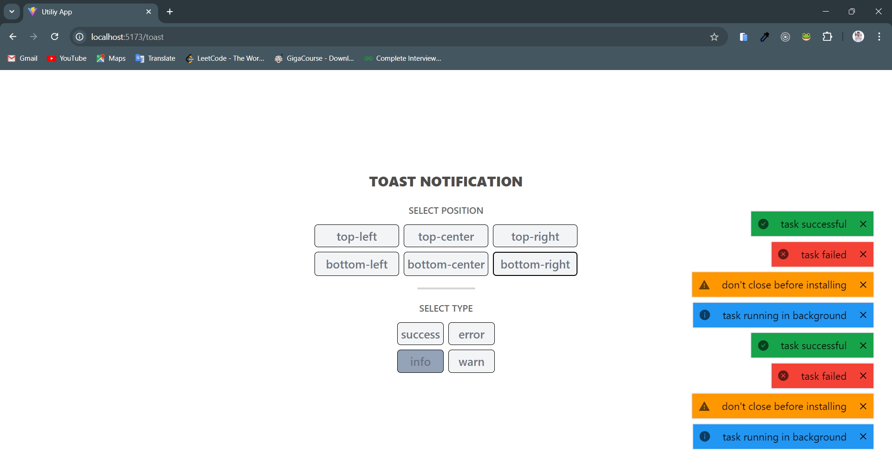

# React Utility Components

This project is a collection of reusable utility components built in **React** and **Typescript**. It aims to provide a set of any React application to enhance functionality and improve development efficiency.

[website](https://react-utility-comp.netlify.app/) - https://react-utility-comp.netlify.app/



## Components

1. Toast Notification
2. Nested Folder System like VS Code

### Toast Notification

It is a lightweight toast component can be used to display notification or messages.
It uses **stack** to store multiple toast automatically disappear after mention time or remove by pressing remove icon.



#### Toast Types

1. Success
2. Error
3. Info
4. Warning

#### Toast Position

1. Top-left
2. Top-Center
3. Top-Right
4. Bottom-left
5. Bottom-Center
6. Bottom-Right

##### Usage -

First, select position
then, select type

### Folder System Like VS Code

It is a folder system just like a VS Code Folder Structure with following features :


#### Functionality :

1. Create Files and Folders
2. Remove Files and Folders
3. Sorted Files and Folders Structure
4. Rename Files and Folders
5. Delete Files and Folders
6. Expand Folder
7. Collapse All Folder with Single Click

## TESTING

This project uses **VITEST** for testing the components.
Vitest is a fast and efficient testing framework, similar to Jest, but optimized to modern JavaScript framework like Vite

### Running Test

To run the test suite, use the following command:

```bash
npm run test
# or
yarn test
```

Vitest will automatically detect and run all test files located in the **test** directory or files ending with .test.tsx.
